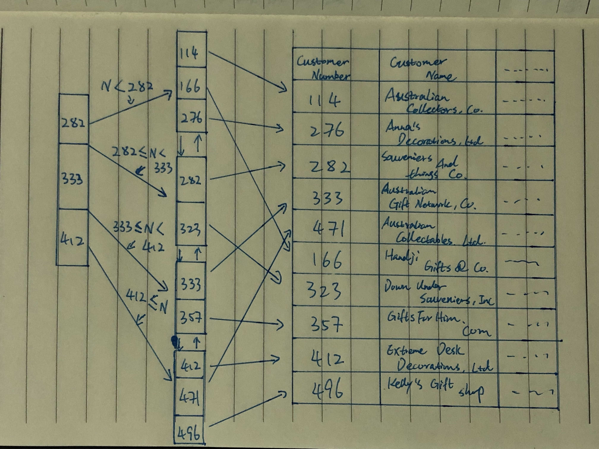

# DatabaseAssignment7

## Exercise 1

### Normal form 1
There are no violations to the first normal form.
Customer number is the primary key here, but in order to uniquely associate salesrep's information with salesrep and customer, a composite primary key composed of customerNumber and repName is used.
### Normal form 2
There is a second normal form violation.

Specifically, there is a functional dependancy issue because the customer number is used to access all of the information regarding the customer, which means a non-key field is not completly depedant on the entire composite primary key. 

Functional dependency is an issue like we mentioned above, not all non-key fields are dependent upon the entire primary key.
if we could use repName to access the salesrep's information, not even need a customer number. 

### Normal form 3
Because the table does not fulfill the requirements to be in normal form 2, it is naturally not in normal form 3 either.

## Exercise 2
To replace Customer Number, we instead use Customer Name, because it is a unique value since you can only have one customer attached in this table. So it means a composite primary key composed of customerName and repName is used.

In regards to violations, you still end up hitting the same second normal form violation, because some all non-key fields are still not dependent upon the entire primary key. 

## Exercise 3
***Statement 1*** <br/>
```MySQL
UPDATE CustomerOverview
SET repPhone = '+12345678'
WHERE repPhone = '+1 125 387 2058'
```
"SQL_SAFE_UPDATES" prevents the MySQL database engine from executing UPDATE and DELETE statements that don't include WHERE clauses that reference the primary key column(s). Update statement 1 is using safe update because ```repPhone``` in WHERE clause is not a primary key column.
<br/> This query will update all the rows WHERE the values of ```repPhone``` is equal to this specified number(+1 125 387 2058). <br/>

***Statement 2*** <br/>
```MySQL
UPDATE CustomerOverview
SET repEmail = 'andyfff3333i@classicmodelcars.com'
WHERE customerName = 'Australian Collectables, Ltd' AND repName = 'Andy Fixter';
```
Update statement 2 will only update the row WHERE the value of the ```customerName``` is equal to the specified customerName ('Australian Collectables, Ltd') AND ```repName``` is equal to the specified repName('Andy Fixter'), which means that other rows that containing the same ```repEmail``` will not be update. <br/>

By look into the result from table after both update statement, we found out that repPhone is not depended on repName but the entire office. When we update the phone number of a specific salesrep, it will end up to also update other salesreps in the same office. We call it *update anomalies*, which means problems that arise when information is inserted, deleted, or updated.
This will cause the query also update other redundant data, when one of them is getting update, which means that database is still un-normalized.

## Exercise 4
***Drawing*** <br/>
By using the customerNumber, we drew a representation of the B+ tree with index and leaf nodes, as well as the actual table data.
<br/>
***Handji Gifts& Co*** <br/>
*Handji Gifts& Co* has ```customerNumber``` 166. By using the B+ tree drawing, the path through the tree is:
1. 166 is smaller than 282, so we are now on leaf node of 282
2. 166 is bigger than 114 and smaller that 276, which means 166 is in between of 114 and 276 i.e., 166 is No.2 value on leaf node of 282.
